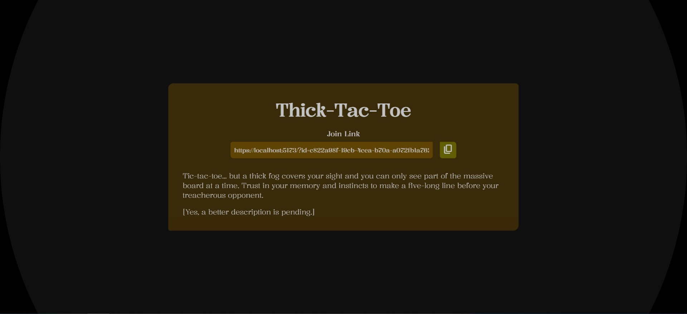

# thick-tac-toe

> Tic-tac-toe... but a thick fog covers your sight and you can only see part of the massive board at a time. Trust in your memory and instincts to make a five-long line before your treacherous opponent.

[Live demo can be found here.](https://lenzrivera.github.io/thick-tac-toe)

Due to time constraints, this project could definitely use a bit more polish. Also, some games may not proceed for some networks due to a lack of a dedicated TURN server for the P2P connections to consistently be made.

## TODO

Includes, but is certainly not limited to:

- Refactor the code to make it neater and more maintainable.
  - Fix all the hacky P2P code
  - Add logging to make debugging P2P and other stuff easier
  - ...and much more (see `TODO` comments in code)
- Panning may perform poorly on certain devices and/or situations. Hopefully this does not entail the usage of `canvas` just to mitigate this.
- Make the sound design a little bit more complete (it was rushed lol).
